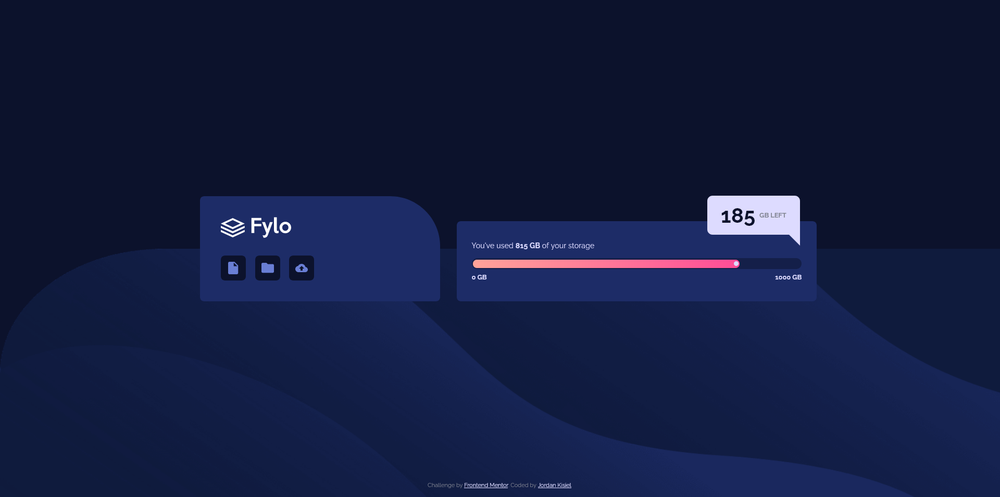

# Frontend Mentor - Fylo data storage component solution

This is a solution to the [Fylo data storage component challenge on Frontend Mentor](https://www.frontendmentor.io/challenges/fylo-data-storage-component-1dZPRbV5n). Frontend Mentor challenges help you improve your coding skills by building realistic projects. 

## Table of contents

- [Overview](#overview)
  - [The challenge](#the-challenge)
  - [Screenshot](#screenshot)
  - [Links](#links)
- [My process](#my-process)
  - [Built with](#built-with)
  - [What I learned](#what-i-learned)
  - [Continued development](#continued-development)
  - [Useful resources](#useful-resources)
- [Author](#author)

## Overview

### The challenge

Users should be able to:

- View the optimal layout for the site depending on their device's screen size

### Screenshot

### Links

- Live Site URL: (https://jordankisiel.github.io/fylo-data-storage-component-master/)

## My process

### Built with

- CSS custom properties
- Flexbox
- CSS Grid
- Mobile-first workflow

### What I learned

I learned how to use absolute positioning to have an element escape and overlap its containing element. I also learned how to use borders to create a triangle shape (in this case to aid in creating a speech bubble effect) purely in CSS. This does, however, feel a little hacky and I wonder if there's a better approach. I also learned about the meter HTML element but I wasn't able to make it look how I wanted so I had to use a div and span method to create a meter instead.

### Continued development

I'd like to try some more complex layouts that require the use of absolute positioning to create.

### Useful resources

- (https://nicolasgallagher.com/pure-css-speech-bubbles/demo/) - This blog helped me quite a bit in creating the CSS triangle that I used for the speech bubble effect.

## Author

- Website - [Jordan Kisiel](https://robojojo.co/)
- Frontend Mentor - [@JordanKisiel](https://www.frontendmentor.io/profile/JordanKisiel)
- Twitter - [@JordanKisiel](https://www.twitter.com/JordanKisiel)
